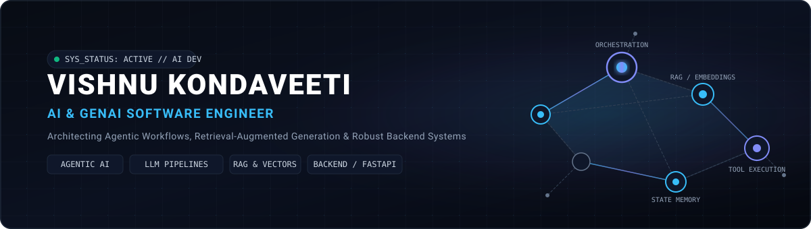
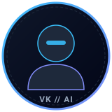

<div align="center">

  <!-- Header Banner -->
  <a href="https://github.com/VishnuKondaveeti">
    
  </a>

  <br/><br/>

  <!-- Circular Profile Avatar Placeholder (Replace assets/profile-placeholder.svg with assets/profile.jpg anytime) -->
  <a href="https://github.com/VishnuKondaveeti">
    
  </a>

  <br/><br/>

  <!-- Hero Identity -->
  <h1>Vishnu Kondaveeti</h1>
  <p><strong>AI / GenAI Software Engineer</strong></p>
  <p><em>Building agentic AI systems, RAG applications, LLM-powered workflows &amp; production-oriented backend infrastructure.</em></p>

  <p>
    <a href="https://linkedin.com/in/vishnu-kondaveeti" target="_blank">
      
    </a>
    &nbsp;
    <a href="https://github.com/VishnuKondaveeti" target="_blank">
      
    </a>
    &nbsp;
    <a href="mailto:vishnukondaveeti.ai@gmail.com">
      
    </a>
  </p>

</div>

---

## 👨‍💻 About Me

I am a **GenAI-focused Software Engineering student** at **Vellore Institute of Technology (VIT-AP)** pursuing an Integrated M.Tech in Computer Science &amp; Engineering (CGPA: **8.91 / 10.0**).

My engineering focuses on taking AI applications from **raw prototypes toward production-oriented systems**—combining frontier LLMs, autonomous agents, hybrid retrieval (RAG + Knowledge Graphs), and asynchronous backend APIs into robust, observable software architectures.

---

## 🚀 Current Focus

<table>
  <tr>
    <td width="50%" valign="top">
      <h4>🤖 Agentic AI &amp; Multi-Agent Systems</h4>
      <p>Building autonomous agents, state machines, and coordinated multi-agent architectures with LangGraph and tool calling.</p>
    </td>
    <td width="50%" valign="top">
      <h4>🧠 RAG &amp; Knowledge Systems</h4>
      <p>Designing hybrid retrieval pipelines combining dense embeddings (ChromaDB/FAISS) with structured Knowledge Graphs (Neo4j).</p>
    </td>
  </tr>
  <tr>
    <td width="50%" valign="top">
      <h4>⚙️ LLM Engineering &amp; Evaluation</h4>
      <p>Deploying local and hosted models (DeepSeek-R1 via Ollama, Gemini), routing, persistent memory, and Ragas evaluation.</p>
    </td>
    <td width="50%" valign="top">
      <h4>🔌 Backend &amp; Microservices</h4>
      <p>Architecting modular FastAPI backends, asynchronous REST APIs, WebSockets, and external service integrations.</p>
    </td>
  </tr>
</table>

---

## 🧠 Technical Skills

<table>
  <tr>
    <td width="26%" valign="top"><strong>GenAI &amp; LLM Systems</strong></td>
    <td>
      <code>RAG</code> • <code>Agentic RAG</code> • <code>AI Agents</code> • <code>Multi-Agent Architectures</code> • <code>Agent Orchestration</code> • <code>Tool Calling</code> • <code>LLM Evaluation (Ragas)</code> • <code>LangChain</code> • <code>LangGraph</code> • <code>Hugging Face Transformers</code> • <code>MCP</code> • <code>Prompt Engineering</code>
    </td>
  </tr>
  <tr>
    <td width="26%" valign="top"><strong>Backend &amp; APIs</strong></td>
    <td>
      <code>FastAPI</code> • <code>REST APIs</code> • <code>Microservices</code> • <code>Async Programming (asyncio)</code> • <code>WebSockets</code> • <code>Webhooks</code> • <code>SQLAlchemy</code> • <code>API Integration</code>
    </td>
  </tr>
  <tr>
    <td width="26%" valign="top"><strong>Databases &amp; Vector Stores</strong></td>
    <td>
      <code>ChromaDB</code> • <code>FAISS</code> • <code>Pinecone</code> • <code>Neo4j (Knowledge Graphs)</code> • <code>SQLite</code> • <code>MySQL</code>
    </td>
  </tr>
  <tr>
    <td width="26%" valign="top"><strong>Machine Learning</strong></td>
    <td>
      <code>Supervised Learning</code> • <code>Unsupervised Learning</code> • <code>Feature Engineering</code> • <code>Model Training</code> • <code>Model Evaluation</code> • <code>Cross Validation</code>
    </td>
  </tr>
  <tr>
    <td width="26%" valign="top"><strong>Deep Learning &amp; Fine-Tuning</strong></td>
    <td>
      <code>PyTorch</code> • <code>Transformers</code> • <code>Transfer Learning</code> • <code>Fine-Tuning</code> • <code>PEFT</code> • <code>LoRA</code> • <code>QLoRA</code>
    </td>
  </tr>
  <tr>
    <td width="26%" valign="top"><strong>Languages</strong></td>
    <td>
      <code>Python</code> • <code>Java</code> • <code>SQL</code>
    </td>
  </tr>
  <tr>
    <td width="26%" valign="top"><strong>Engineering &amp; Testing</strong></td>
    <td>
      <code>API Testing</code> • <code>Integration Testing</code> • <code>Debugging</code> • <code>Troubleshooting</code> • <code>Postman</code>
    </td>
  </tr>
  <tr>
    <td width="26%" valign="top"><strong>Infrastructure</strong></td>
    <td>
      <code>Docker</code> • <code>Git</code> • <code>Linux / Shell</code>
    </td>
  </tr>
</table>

---

## 💼 Experience

<table>
  <tr>
    <td>
      <h3>🔹 AI &amp; Cloud Virtual Intern — IBM SkillsBuild</h3>
      <p><strong>September 2025 – October 2025</strong></p>
      <ul>
        <li>Developed end-to-end machine-learning workflows using Python for <strong>data preprocessing, feature engineering, model training, and evaluation</strong>.</li>
        <li>Applied supervised and unsupervised learning techniques across classification and regression tasks.</li>
        <li>Evaluated models using <strong>k-fold cross-validation, Precision, Recall, and F1-Score</strong>.</li>
        <li>Explored cloud-based AI workflows and practical machine-learning development.</li>
      </ul>
    </td>
  </tr>
  <tr>
    <td>
      <h3>🔹 AI &amp; Data Analytics Virtual Intern — Shell</h3>
      <p><strong>October 2025 – November 2025</strong></p>
      <ul>
        <li>Performed <strong>exploratory data analysis (EDA)</strong> using Python, Pandas, and NumPy.</li>
        <li>Applied data cleaning, transformation, and validation techniques to structured datasets.</li>
        <li>Used statistical analysis and visualization to identify patterns and evaluate model outputs.</li>
        <li>Supported data-driven decision making through analytical insights.</li>
      </ul>
    </td>
  </tr>
</table>

---

## 📚 Education

<table>
  <tr>
    <td>
      <h3>🎓 Vellore Institute of Technology (VIT-AP), India</h3>
      <p><strong>Integrated M.Tech in Computer Science &amp; Engineering</strong> &nbsp;|&nbsp; <em>2022 – 2027</em></p>
      <p><strong>Academic Standing:</strong> <code>CGPA: 8.91 / 10.0</code></p>
    </td>
  </tr>
</table>

---

## 🔥 Featured AI Projects

### 1. [AgentOS — Autonomous AI Personal Assistant](https://github.com/VishnuKondaveeti/agentOS)
> **Multi-Channel Event-Driven Agentic Operating System**
>
> <code>4 Automated Pipelines</code> • <code>10 REST APIs</code> • <code>Persistent Entity Memory</code>
>
> - **Event-Driven Orchestration:** Engineered an event-driven orchestration system spanning **4 automated pipelines** across Email, WhatsApp, and Voice.
> - **DeepSeek-R1 Reasoning:** Powered by **DeepSeek-R1 (via Ollama)** for intent classification, summarization, response generation, and automated notifications.
> - **Backend Microservices:** Modular **FastAPI** backend exposing **10 REST APIs** integrated with Gmail API, WhatsApp Cloud API, and Vapi.ai.
> - **Persistent Memory:** Implemented persistent, entity-aware LLM memory using **SQLAlchemy and SQLite** for context-aware responses.
> - **Stack:** `DeepSeek-R1` • `Ollama` • `FastAPI` • `n8n` • `SQLite` • `Docker` • `Gmail API` • `WhatsApp API` • `Vapi.ai`

```text
[Channels: Email / WhatsApp / Voice]
                ↓ (Webhooks)
        [Event Processing]
                ↓
        [AI Orchestration] ←→ [Persistent Memory (SQLite)]
                ↓
        [DeepSeek-R1 (Ollama)]
                ↓
        [Action & Channel Dispatch]
```

<p align="right"><a href="https://github.com/VishnuKondaveeti/agentOS"><strong>View agentOS Repository →</strong></a></p>

---

### 2. [Agentic AI Multi-Agent Research Platform](https://github.com/VishnuKondaveeti/agentic-research-matrix)
> **Autonomous Multi-Agent Academic Discovery &amp; Knowledge Graph Engine**
>
> <code>16 LangGraph Agents</code> • <code>47 Papers Indexed</code> • <code>1,449+ Embeddings</code> • <code>18 REST APIs</code>
>
> - **Multi-Agent Coordination:** Dynamic **16-agent LangGraph architecture** orchestrating specialized search, review, reasoning, and synthesis agents.
> - **Hybrid RAG + Knowledge Graph:** Dual-layer retrieval combining **ChromaDB dense vector embeddings** with **Neo4j graph relationships**.
> - **Academic Corpus Ingestion:** Indexed **47 research papers** and **1,449+ embeddings** across 4 research APIs (arXiv, Semantic Scholar, OpenAlex, CORE).
> - **High-Throughput Backend:** FastAPI service exposing **18 REST APIs** for automated ingestion and agent workflow execution.
> - **Stack:** `LangGraph` • `Gemini` • `ChromaDB` • `Neo4j` • `FastAPI` • `Agentic RAG`

```text
[Research APIs: arXiv / OpenAlex / Semantic Scholar / CORE]
                            ↓
                   [Semantic Ingestion]
                            ↓
            [ChromaDB (Vectors) + Neo4j (Graph)]
                            ↓
            [16-Agent LangGraph Reasoning System]
                            ↓
                    [Research Synthesis]
                            ↓
                       [Final Report]
```

<p align="right"><a href="https://github.com/VishnuKondaveeti/agentic-research-matrix"><strong>View Research Platform Repository →</strong></a></p>

---

### 3. [Agentic RAG System](https://github.com/VishnuKondaveeti/Agentic-RAG-Pipeline)
> **Context-Aware Document Intelligence with Dynamic Intent Routing**
>
> <code>2 Execution Paths</code> • <code>Top-3 Similarity Retrieval</code> • <code>DeepSeek-R1 7B Local</code>
>
> - **Adaptive Query Routing:** Built an Agentic RAG system using **LangChain LCEL** with an intent router dynamically selecting between **Retrieval-Augmented Generation** and **Direct Generation**.
> - **Semantic Indexing:** Ingestion pipeline with **all-MiniLM-L6-v2** embeddings, 1,000-character chunks, 200-character overlap, and top-3 similarity retrieval.
> - **Explainable Attribution:** Integrated source attribution and routing-decision visualization to eliminate hallucinations.
> - **Local LLM Inference:** Ran **DeepSeek-R1 7B locally via Ollama** for private, low-latency execution.
> - **Stack:** `LangChain LCEL` • `DeepSeek-R1` • `ChromaDB` • `Hugging Face` • `FastAPI` • `Ollama`

```text
                  [User Query]
                       ↓
               [Intent Router]
               ↙             ↘
     [RAG Pipeline]      [Direct Generation]
           ↓                      ↓
      [ChromaDB]                  |
           ↓                      |
     [Context Retrieval]          |
           └──────────┬───────────┘
                      ↓
              [DeepSeek-R1 7B]
                      ↓
      [Explainable Response + Citations]
```

<p align="right"><a href="https://github.com/VishnuKondaveeti/Agentic-RAG-Pipeline"><strong>View Agentic RAG Repository →</strong></a></p>

---

## 🏗️ Engineering Philosophy

> *"Don't just wrap an API around an LLM. Build the system around it."*

```text
LLM
 ↓
Prompting & Structured I/O
 ↓
Agents & Orchestration
 ↓
Tools & APIs
 ↓
Retrieval & Memory
 ↓
Backend Services
 ↓
Evaluation
 ↓
Deployment
```

---

## 📊 GitHub Activity & Metrics

<div align="center">
  
  &nbsp;&nbsp;
  
</div>

---

## 📫 Connect With Me

<div align="center">

  **Interested in collaborating on Agentic AI, RAG architectures, or backend AI infrastructure?**
  
  [LinkedIn](https://linkedin.com/in/vishnu-kondaveeti) • [GitHub](https://github.com/VishnuKondaveeti) • [Email](mailto:vishnukondaveeti.ai@gmail.com)

  <br/><br/>
  <sub>⚡ Building AI systems that move beyond the chatbot.</sub>

</div>
